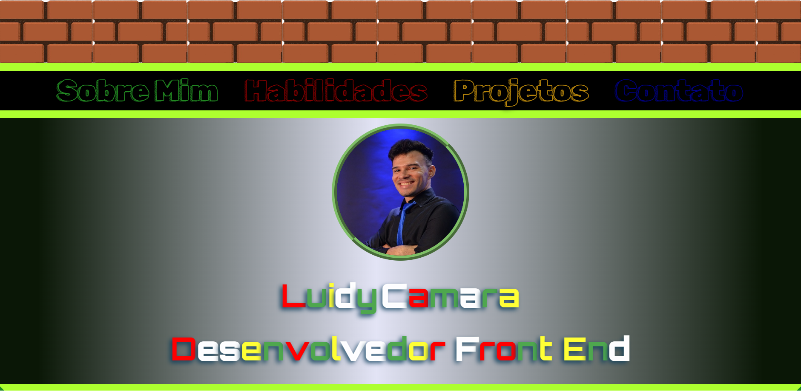

# Portfólio

## Tabela de Conteúdo
<ul>
<li><a href="#sobre">Sobre</a></li>
<li><a href="#objetivo">Objetivo</a></li>
<li><a href="#tecnologias">Tecnologias</a></li>
<li><a href="#resultado">Resultado</a></li>
</ul>

## 📃 Sobre
Este projeto foi criado como proposta para conclusão de um desafio do curso DevQuest. É possível notar algumas referências ao Mario e Luigi nas cores e tema do portfólio. Isso se deu devido a uma ideia de referência que eu tive com relação ao meu nome.

## 🎯 Objetivo

O desafio proposto era criar um portfólio apresentável utilizando os conhecimentos adquiridos ao longo dessa primeira jornada do curso DEVQUEST (desde o html báico ao css avançado). Nesse projeto, também foi criado uma pequena interação de JavaScript.

## 🚀 Tecnologias

* HTML
* CSS
* JAVASCRIPT

## 🔖 Resultado

---

Feito por Luidy Camara

